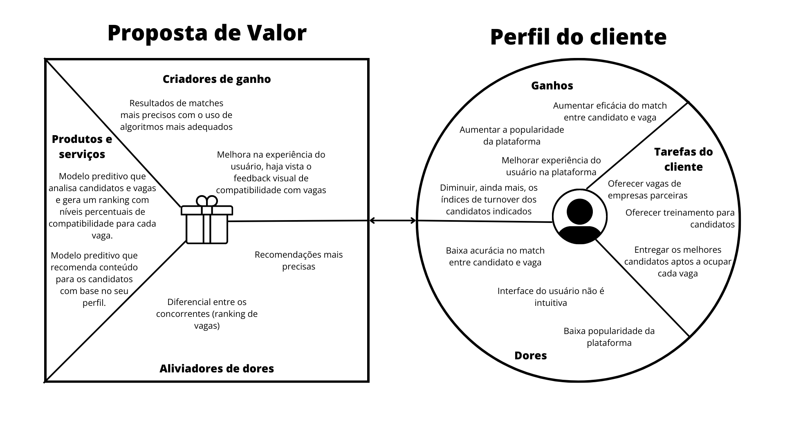
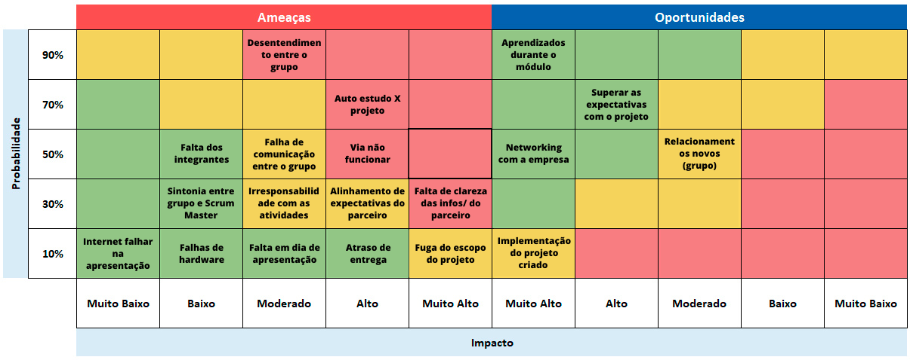
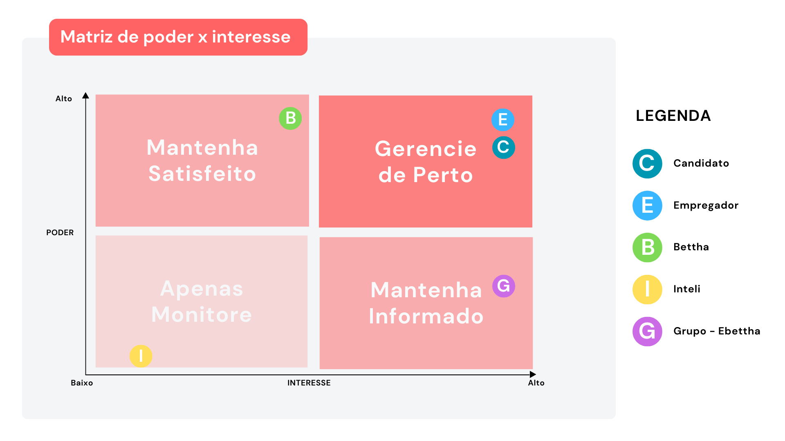
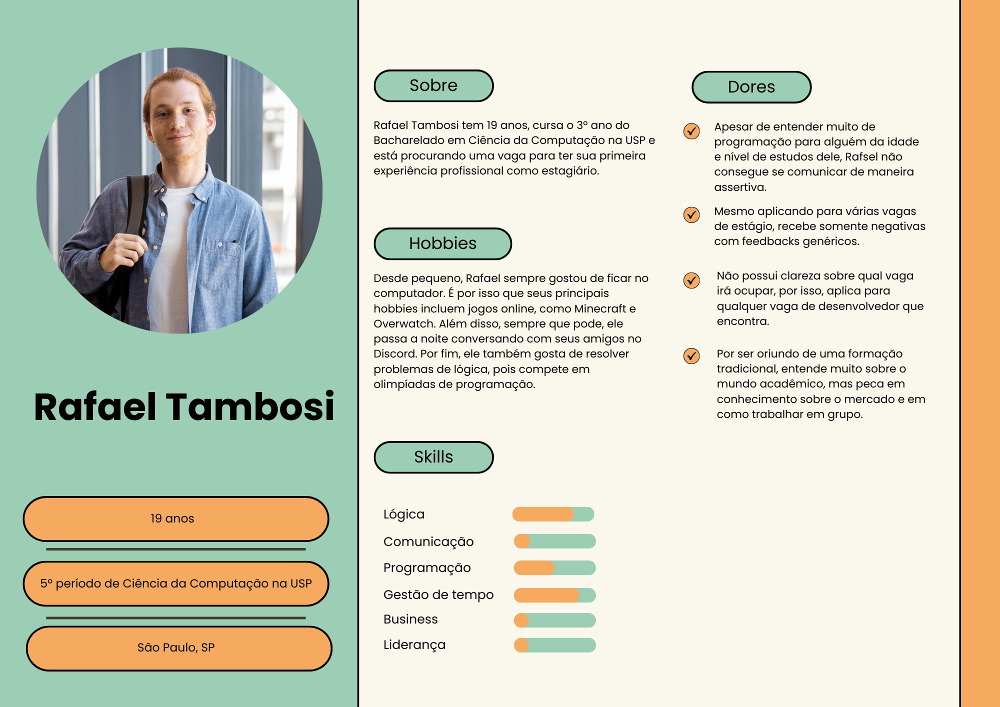
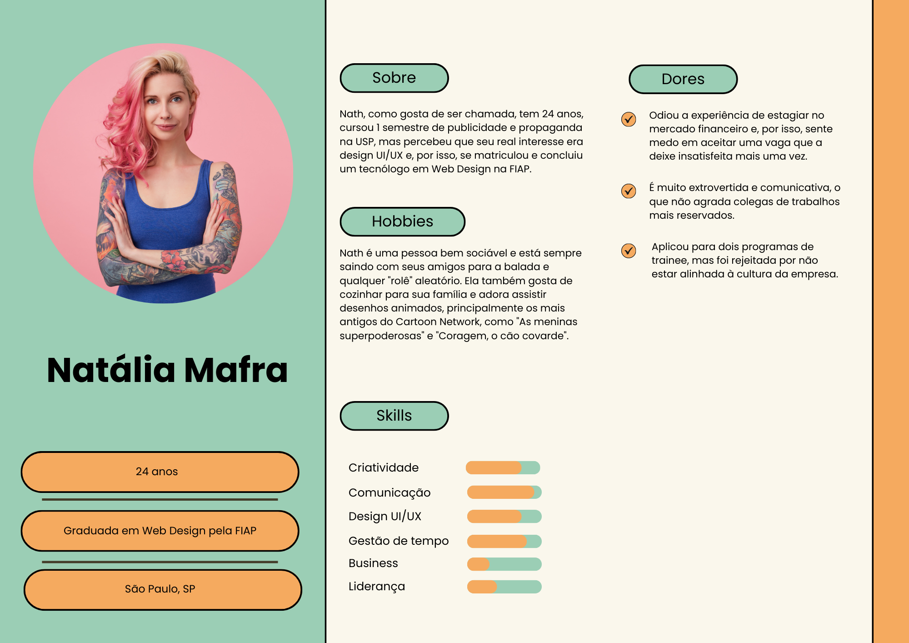
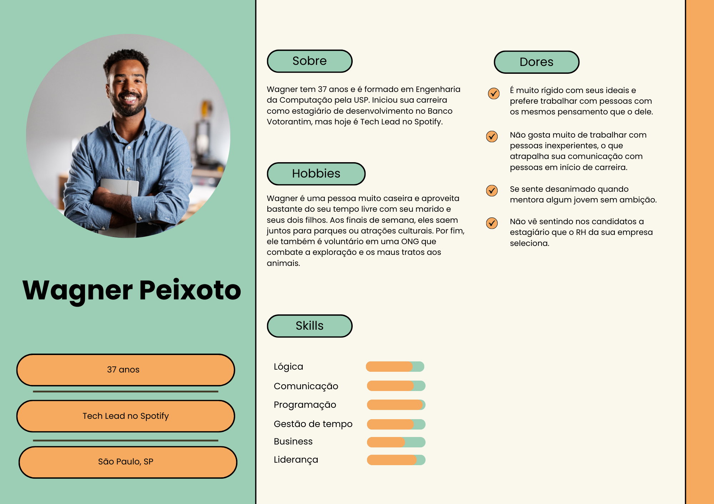
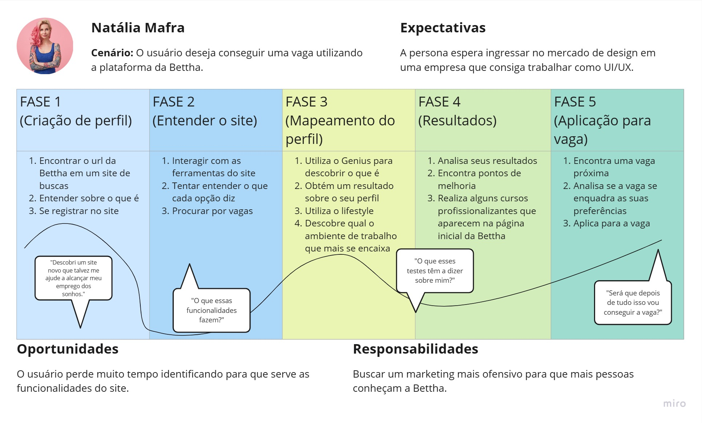
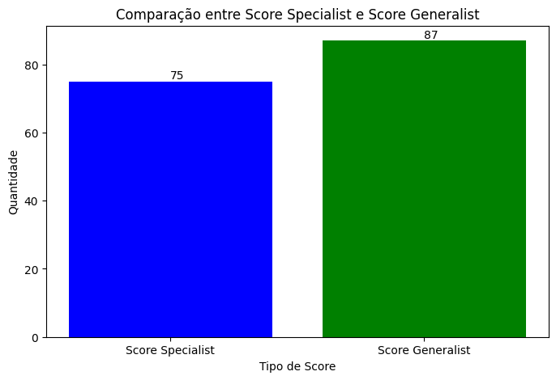
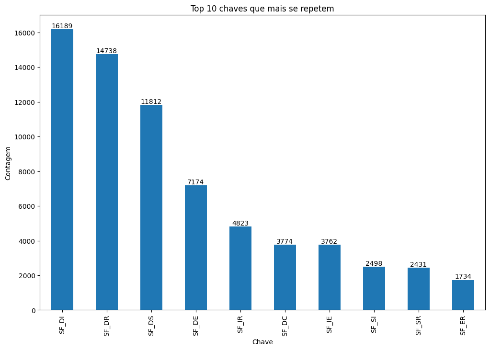
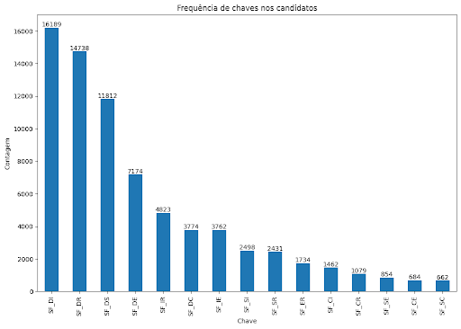

# Documentação Modelo Preditivo - Inteli

## Ebettha

### Ebettha

#### Eduarda Cardoso de Souza, Gabrielly Silva Vitor, Luan Ramos de Mello, Matheus Ribeiro dos Santos, Maurício de Azevedo Neto, Murilo de Souza Prianti Silva e Ólin Medeiros Costa.

## Sumário

[1. Introdução](#c1)

[2. Objetivos e Justificativa](#c2)

[3. Metodologia](#c3)

[4. Desenvolvimento e Resultados](#c4)

[5. Conclusões e Recomendações](#c5)

[6. Referências](#c6)

[Anexos](#attachments)

## 1. Introdução

&emsp; O início de carreira é um momento muito tempestuoso na vida dos jovens. Programas de trainee, por exemplo, podem chegar a ser quase 30 vezes mais concorridos do que entrar no curso mais disputado da Universidade de São Paulo, que apresenta uma proporção de 118 candidatos para cada vaga. É nesse contexto que entra em jogo o Bettha, uma empresa nascida em 2017 como braço direito do grupo Cia de Talentos e que visa preparar e desenvolver pessoas, antes mesmo do processo seletivo para ingressar no mercado de trabalho.

&emsp; Outra questão que merece destaque é o fato do Brasil ser o país com o maior índice de turnover dentro das organizações, apresentando o dobro da média mundial. Dessa forma, a empresa acaba perdendo o dinheiro investido no recrutamento. A fim de driblar essa realidade, o Bettha mapeia o perfil comportamental e conhecimentos específicos de cada candidato e gera um match (combinação entre duas ou mais partes com características compatíveis) entre vagas e participantes.

&emsp; Tal ação é positiva tanto para as empresas que estão ofertando vagas, quanto para os candidatos. Isso porque, primeiro, quem está concorrendo a determinado cargo, visualiza somente recomendações para ocupar funções que combinam com suas características, o que proporciona não só um aumento nas chances de ser aceito, como também eleva a probabilidade de permanência no cargo em caso de contratação. Com isso, a organização tende a receber pessoas mais adeptas às características procuradas, ao passo que, reduz a temida taxa de turnover.

&emsp; Apesar de saber da relevância de oferecer essa funcionalidade em sua plataforma, o Bettha padece de uma baixa acurácia nos resultados desses matches. Nesse sentido, o principal desafio deste projeto é construir um modelo preditivo que seja capaz de aprimorar o nível de assertividade da aplicação já existente, proporcionando uma melhor experiência tanto para quem está aplicando, quanto para quem oferece vagas no Bettha.

## 2. Objetivos e Justificativa

&emsp; Neste tópico, serão explorados os objetivos deste projeto, bem como as justificativas que fundamentam o seu desenvolvimento. A seção está dividida em três partes distintas: "objetivos", que trata a respeito das metas a serem alcançadas com o trabalho desta equipe, "proposta de solução", na qual descreve sucintamente o que será desenvolvido e, por fim, "justificativa", cujo ponto focal é narrar a relevância em produzir a proposta de solução previamente esplanada.

### 2.1 Objetivos

&emsp; De maneira geral, este projeto visa garantir aos utilizadores da plataforma do Bettha, uma melhor experiência durante o processo de recrutamento, assistindo desde os candidatos, até às instituições que disponibilizam vagas.

&emsp; É primordial entender que, acima de tudo, este projeto está sendo construído com fins didáticos. Dessa forma, a primeira meta diz respeito ao aprendizado dos integrantes deste trabalho, que será alcançado por cada membro com aulas presenciais, livros e videoaulas fornecidos pelo Inteli, bem como o desenvolvimento deste projeto. É possível considerar que ele foi atingido se, ao final das 10 semanas de duração do módulo, todos os membros conseguirem entender e reproduzir as etapas para a construção de um modelo preditivo.

&emsp; Após estas validações, o modelo desenvolvido será lapidado de tal forma que possa atender ao feedback dado pelo cliente na apresentação anterior. Estas melhorias devem ser feitas até a data limite do projeto – o final da semana 10. Isso ocorrerá para que, na apresentação final, o time consiga entregar ao Bettha um modelo que atenda às demandas anteriormente expostas neste documento.

&emsp; Cumprir todos estes objetivos é indispensável para atingir a última meta, que consiste na utilização do projeto aqui desenvolvido em um ambiente de produção no Bettha ou, quando menos, que ele sirva de alicerce para a implementação de um modelo de match mais eficaz do que o atualmente existente na sua plataforma.

### 2.2 Proposta de solução

&emsp; Assim como mencionado na introdução deste documento, o Bettha padece de um match entre candidato e vaga com baixa acurácia. Com isso em vista, a solução aqui proposta ataca diretamente esta fraqueza e consiste na elaboração de um modelo preditivo que seja capaz de mensurar numericamente, em um percentual de 0% a 100%, a compatibilidade de um candidato com cada uma das vagas ofertadas no Bettha.

&emsp; Além disso, estes resultados serão exibidos em formato de ranking, possibilitando ao usuário uma melhor identificação sobre qual vaga mais combina com seu perfil.

### 2.3 Justificativa

&emsp; O setor de recrutamento, no qual o Bettha atua, é um mercado extremamente concorrido. Assim sendo, é indispensável que ele apresente algum diferencial para conseguir convencer outras empresas a realizarem seus processos seletivos dentro de sua plataforma, Bettha. Por isso, o desenvolvimento deste projeto entregará duas funcionalidades, as quais permitirão uma vantagem competitiva do Bettha frente aos seus concorrentes.

## 3. Metodologia

&emsp; CRISP-DM é uma sigla que, em português, significa “Processo Padrão Inter-Indústrias para Mineração de Dados”. Trata-se de uma metodologia muito utilizada atualmente por empresas que buscam desenvolver estratégias para prever e resolver problemas com base em dados já existentes (ROBERTO, 2023).

&emsp; A metodologia CRISP-DM é um ciclo que possui seis estágios, sendo eles: entendimento do negócio; entendimento dos dados; preparação de dados; modelagem; avaliação e implementação. Esses estágios podem ser iterativos, ou seja, durante a análise dos dados novos insights e dúvidas podem surgir e caso isso aconteça, essa metodologia possibilita a dinâmica de retornar alguns dos estágios para alteração, se for necessário (AFFONSO, 2023).

&emsp; O primeiro estágio da CRISP-DM é o entendimento do negócio, isto é, identificar os objetivos do negócio e as necessidades da empresa. No caso deste projeto foi necessário conversar com os representantes da empresa, esclarecer dúvidas e preencher as matrizes para análise de mercado. Com isso, foi possível compreender as dores do parceiro e avançar para o segundo estágio, que consiste no entendimento dos dados. Nessa etapa foi necessário analisar detalhadamente todos os dados das planilhas que foram fornecidas, tanto sobre os candidatos, quanto para as vagas e gestores. Ademais, com a finalização desse processo o grupo seguiu com o andamento do ciclo.

&emsp; Outrossim, o terceiro estágio é a preparação dos dados, ou melhor dizendo, comparar, agrupar, dividir ou reorganizar os dados recebidos, caso necessário. Para o projeto em parceria com o Bettha, essa etapa foi realizada em equipe e foi imprescindível para o começo do próximo estágio, sendo a modelagem do projeto. A modelagem consiste em aplicar os dados que foram recebidos e analisados pelo grupo em um modelo de aprendizado que melhor se adequa como solução para a problemática do parceiro.

&emsp; Os próximos estágios são avaliação e implementação, os quais consistem em testar e analisar os resultados de uma possível implementação no mercado e, por fim, se os resultados forem favoráveis, implementar o projeto no mercado.

Figura 01 - Metodologia CRISP-DM - Bettha

Fonte: Elaborado pelos autores.

## 4. Desenvolvimento e Resultados

&emsp; Nesta seção, serão apresentados todos os passos que foram necessários para desenvolver a solução proposta, como se deu o processo de análise para entender o problema apresentado pelo Bettha e como a empresa se encaixa no ramo de recrutamento e seleção.

### 4.1. Compreensão do Problema

&emsp; Antes de adentrar no desenvolvimento do código que trará os resultados esperados, é necessário entender a fundo qual problema pretende-se resolver. Para isso, os próximos tópicos abordarão uma análise de negócios, desenvolvida com base nos cenários internos e externos ao Bettha, bem como uma investigação sobre a experiência do usuário. Estas etapas são importantes, pois permitem entender quais as principais dores enfrentadas pelo cliente atualmente e fornecem insights sobre como é possível resolvê-las.

#### 4.1.1. Contexto da indústria

&emsp; O Bettha atua no setor de recrutamento e seleção. Ao pensar nesta área, é comum lembrar de grandes nomes, tais quais Linkedin, Catho e Gupy. Tal coisa já é um forte indicativo de que este mercado se caracteriza como um oceano vermelho. Contudo, para que seja possível realizar uma investigação mais precisa, o grupo fez uma análise baseada nas 5 forças de Porter, estudando quais são os concorrentes atuais e potenciais do Bettha, bem como seus clientes, fornecedores e produtos que possam vir a substituí-lo. Com isso, foi possível chegar na tabela mostrada a seguir, cuja explicação vem logo abaixo.

Tabela 01 - Análise da indústria na qual a Bettha está inserida

|          Força          |                                        Quem são?                                         |                                                                                                 Quais ameaças?                                                                                                 |                                                        Quais as minhas possíveis reações?                                                         |
| :---------------------: | :--------------------------------------------------------------------------------------: | :------------------------------------------------------------------------------------------------------------------------------------------------------------------------------------------------------------: | :-----------------------------------------------------------------------------------------------------------------------------------------------: |
|   Concorrentes atuais   | Grupo 01: LinkedIn, Gupy e Catho. & Grupo 02: Cia de estágios, Matchbox, Across e Espro. | Grupo 01: Empresas que atuam no mesmo nicho e que podem ganhar preferência das empresas e usuários. & Grupo 02: Investimento pesado em marketing, o que pode acarretar na preferência das empresas e usuários. |                                    Rebranding, implementação de novas tecnologias e investimento em marketing                                     |
| Concorrentes potenciais |                                     Becas Santander                                      |                                      Novas empresas/startups, ou até mesmo escolas e/ou fundações oferecerem os serviços gratuitamente para jovens em início de carreira.                                      |                                                               Investir em marketing                                                               |
|  Produtos substitutos   |                       Trybe, Cubos Academy, Ada Tech Alura e Tera                        |                                          Fornecem formação completa em tecnologia e, por terem parceria com diversas empresas, possuem um índice de empregabilidade.                                           |           Expandir relacionamento já existente com empresas parceiras para ofertar capacitação e garantir a geração de novos empregos.            |
|      Fornecedores       |               AWS, conexão com internet, energia e infraestrutura no geral               |                                                Vazamento de dados, instabilidade na hospedagem da plataforma, ataques hackers e indisponibilidade de serviços.                                                 |       Diversificar o serviço de armazenamento e hospedagem em nuvem, investir em segurança de dados e buscar acordo em relação aos preços.        |
|        Clientes         |                                  Empresas e candidatos                                   |                                              Empresas anunciarem vagas em outras plataformas e, por consequência, os candidatos se cadastrarem em outros lugares.                                              | Para empresas, criar planos para fidelizar e atrair o anúncio de vagas. Para usuários, recomendar trilhas de capacitação e melhorar a UX do site. |

Fonte: Elaborada pelos autores

&emsp; Iniciando-se a análise pelos concorrentes atuais, verifica-se dois grandes grupos que se caracterizam como concorrência direta. O primeiro deles enquadram empresas como LinkedIn, Gupy e Catho, que já são muito consagradas no ramo e investem pesado em marketing. Isso pode fazer com que as empresas que oferecem vagas tenham preferência por elas, deixando o Bettha em segundo plano.

&emsp; Para contornar essa situação, o Bettha deve, obviamente, investir em marketing e até mesmo passar por um processo de rebranding, mas isto não será suficiente. Ela deve apresentar algum recurso tecnológico que seja capaz de tornar todo o processo de recrutamento mais eficiente. A Gupy, por exemplo, utiliza inteligência artificial para selecionar os currículos que possuem maiores chances de serem escolhidos para uma vaga. Utilizar métodos similares torna o processo de seleção mais barato, o que é atrativo para empresas que pretendem anunciar vagas.

&emsp; Além disso, existe um segundo grupo de empresas, formado pela Companhia de Estágios, Matchbox, Across e Espro, as quais atuam no mesmo nicho que o Bettha, oferecendo vagas para pessoas no início de carreira. Ainda que elas também não sejam tão conhecidas, alguma organização que pretenda oferecer vagas específicas em programas de estágio ou trainee pode dar preferência para essas outras empresas. Para minimizar esta ameaça, o Bettha deve seguir os mesmos procedimentos descritos no parágrafo anterior.

&emsp; Em seguida, tem-se a análise no que tange aos concorrentes potenciais. Atualmente, não existem tantas empresas que possam representar, futuramente, “dor de cabeça” para o Bettha. A Fundação Becas Santander, pertencente ao banco Santander, tem o objetivo de fornecer bolsas de estudos para pessoas em início de carreira e, apesar de não ser o foco da plataforma, também oferece vagas de estágio. Se essa prática se consolidar, a fundação pode investir em parcerias para disponibilizar mais programas de estágios, representando um risco real para o Bettha. Ademais, isso pode ser replicado por outras fundações e/ou escolas que queiram contribuir para a inclusão de jovens no mercado de trabalho.

&emsp; Assim como nos concorrentes diretos, para minimizar os efeitos destes riscos, é necessário que o Bettha invista em marketing para atrair o olhar de novas empresas que possam anunciar vagas em sua plataforma. Essas campanhas publicitárias também devem ter enfoque no usuário, pois, atualmente, 3% do tráfego do site é orgânico, enquanto todo o restante é fruto do redirecionamento de hotsites próprios das instituições que estão anunciando vagas.

&emsp; Posteriormente, observa-se os produtos substitutos. Hoje em dia, existem várias startups educacionais que representam ameaça ao Bettha. A Trybe, por exemplo, oferece formação em programação na modalidade “Sucesso Compartilhado”. Isso significa que, enquanto o aluno está aprendendo, não é necessário efetuar nenhum pagamento. Contudo, quando ele é contratado por alguma empresa, ele começa a pagar a sua formação com parte do seu salário. Esse esquema é muito atrativo para quem está no início de carreira, principalmente porque, graças às parcerias que a Trybe firma, o seu índice de empregabilidade chega aos 92%. Outras empresas como Tera, Cubos Academy, Ada Tech e Alura possuem programas similares.

&emsp; Pensando em um jovem que está procurando sua primeira experiência profissional, é muito sedutor optar por um programa similar ao da Trybe, ao invés de concorrer com outros milhares de candidatos por uma vaga, como acontece no Bettha. Por isso, é fundamental que o Bettha pense em estratégias para mitigar os danos que possam acontecer em função desse cenário. Se pensar que ela já possui parcerias com grandes empresas, tal qual a Google, o objetivo seria expandir essas colaborações para que o Bettha ofertasse uma formação mais consolidada e, com isso, pudesse entregar maiores taxas de empregabilidade, despertando interesse nos candidatos.

&emsp; Outrossim, é necessário também pensar nos fornecedores do Bettha. Estes, não são triviais de se elencar, haja vista que todos os seus serviços são digitais e eles não possuem fornecedores diretos de matéria prima. Nesse sentido, fornecedores mensuráveis são a Amazon Web Services (AWS), responsável por hospedar a plataforma, bem como armazenar todos os dados coletados dos usuários e os demais fornecedores estão relacionados à infraestrutura do prédio, como provedor de internet e luz.

&emsp; Logo, as principais ameaças são relativas ao meio tecnológico, como a indisponibilidade dos serviços da AWS, que impediria o acesso à plataforma Bettha. Além disso, considerando a quantidade de dados pessoais e sensíveis armazenados, um ataque hacker que levasse ao vazamento desses dados poderia causar o pagamento de multas milionárias por infringir a Lei Geral de Proteção de Dados Pessoais (LGPD). Segurança nunca é demais e, por isso, o Bettha precisa investir em segurança digital se não quiser que estas ameaças não se tornem um problema. Além disso, buscar diversificar os serviços de hospedagem da sua plataforma, garantindo que, caso um provedor fique indisponível, o outro possa assumir o tráfego para que o acesso ao site do Bettha não fique interrompido.

&emsp; Por fim, para analisar os clientes, foi feita uma divisão em duas partes: as empresas que ofertam vagas e os candidatos. Já que 97% dos acessos no Bettha correspondem ao redirecionamento de hotsites de outras empresas, a principal ameaça seria a preferência dessas instituições por outros serviços de recrutamento, o que levaria a perda de acesso dos usuários.

&emsp; Nesse sentido, é necessário que o Bettha crie planos que possam fidelizar clientes que já anunciam vagas na sua plataforma, bem como estes programas possam atrair novos clientes. Com isso, os usuários continuariam sendo atraídos para a plataforma. Entretanto, para garantir que o candidato goste do site, é necessário rever a interface, haja vista que ela é muito poluída e não é tão intuitiva. Uma síntese dessa discussão pode ser observada na matriz de 5 forças de Porter na imagem abaixo.

Figura 02 - 5 forças de porter - Bettha

Fonte: Elaborado pelos autores

&emsp; Esclarecendo uma última vez:

- O poder de barganha dos fornecedores é alto, pois, além de existirem poucos players capazes de hospedar grandes aplicações, caso a Bettha queira trocar de um para outro, terá que renunciar a serviços específicos daquela empresa;
- A ameaça de novos entrantes é alta, haja vista que a barreira de entrada no segmento é baixíssima;
- A ameaça de produtos substitutos é média. Isso ocorre porque, como visto anteriormente, apesar de haverem métodos mais garantidos para se conseguir o primeiro emprego, muitas pessoas preferem seguir os métodos tradicionais de seleção oferecidos pela Bettha, logo, a ameaça não é alta, mas existe e pode causar dor de cabeça no futuro;
- O poder de barganha dos clientes é alto para a empresa e baixo para os candidatos. Assim como já mencionado na análise anterior, por haver várias empresas que realizam um trabalho igual ao da Bettha, as organizações podem oferecer vagas em qualquer outra plataforma. Contudo, o candidato fica refém da Bettha no momento em que a vaga que ele quer está anunciada no site. Além disso, ele não tem poder suficiente para escolher se candidatar para aquela vaga em outro site.
- Finalmente, a rivalidade entre concorrentes é alta, haja vista que existem vários players competindo por pequenas quotas do mercado.

#### 4.1.2. Análise SWOT

&emsp; Na análise SWOT, avaliam-se os pontos fortes e fracos de uma empresa, observando o cenário externo à organização, assim como o cenário interno. Sua importância reside na de criação de um panorama da empresa, o qual permite avaliar e evidenciar situações que podem ser desfavoráveis para a empresa, possibilitando a tomada de decisões para conter o problema. Ela também é capaz de gerar insights acerca de como conquistar oportunidades existentes no mercado. Sabendo disso, este grupo realizou a referida análise, cujo resultado pode ser conferido na imagem abaixo.

Figura 03 - Análise SWOT - Bettha

Fonte: Elaborado pelos autores

&emsp; Agora, é necessário entender cada um dos pontos destacados. Iniciando-se pelas forças do inglês “strengths” onde foram analisados todos os pontos positivos da organização que colocam ela à frente de outras organizações do mesmo setor. Além disso, estes são pontos que dependem do Bettha, ou seja, ela tem influência e consegue interferir. Enumera-se:

- Grande base de dados e experiência no mercado: O Bettha possui uma boa quantidade de dados robustos, que agregam valor à empresa e auxiliam na construção de um serviço mais fidedigno. Além de anos de experiência de mercado, ambos provenientes do tempo que estiveram vinculados à “Companhia de Talentos”.
- Parceria com grandes empresas: Visto que os clientes do Bettha são as empresas, essas parcerias com grandes empresas consolidadas no mercado para a oferta de vagas (Como, por exemplo, a Red Bull, Nestlé, Mondelez, Even) são essenciais para o seu crescimento, pois auxiliam na divulgação do serviço como algo positivo e confiável. Além disso, o Bettha possui parcerias nas quais disponibilizam cursos profissionalizantes para os usuários, como no caso do programa “Transforma”, junto à Google.
- Oferta de treinamentos gratuitos: A plataforma do Bettha possui um grande diferencial que é a oferta de conteúdos profissionalizantes para usuários. A disponibilidade de tais materiais possui como objetivo o desenvolvimento profissional e preparo dos consumidores para poderem conquistar e se adequar às respectivas vagas de interesse.
- Forte relacionamento com empresas: O Bettha possui uma política de acompanhamento de seus clientes (até mesmo depois do preenchimento da vaga solicitada) por meio de feedbacks, o que demonstra comprometimento e passa uma maior confiabilidade para com a empresa contratante.
- Suporte aos usuários: Utilizando as suas ferramentas (Genius, Lifestyle, Workstyle), o Bettha oferece serviços para os candidatos que ajudam a mapear o seu perfil e apresentar vagas onde eles se enquadram melhor, além de planos para desenvolvimento.
- Escolha de público-alvo: O Bettha possui como público alvo pessoas que estão ingressando no mercado de trabalho, preenchendo uma lacuna - visto que outras empresas rivais oferecem um serviço mais generalizado - e fornecendo suporte para essa iniciação.
- Baixa rotatividade nos candidatos indicados: Segundo análises feitas, após a contratação realizada por empresas utilizando os serviços do Bettha, a taxa de desligamento desses funcionários posteriormente é baixa, possuindo um turnover de 0 nos 6 primeiros meses.

&emsp; Ainda no ambiente interno, existem as fraquezas, do inglês “weaknesses”, onde avaliou-se os pontos fracos do Bettha, os quais podem acabar dando vantagem aos seus concorrentes.

- Baixo reconhecimento na área: A Bettha se encontra em um mercado de alta concorrência e, por possuir um marketing discreto e pouco atuante, não adquire tanto reconhecimento pelas pessoas como outras plataformas mais consolidadas e utilizadas.
- Vulnerabilidade a ataques e indisponibilidade: Considerando que o serviço do Bettha é oferecido majoritariamente de forma online, as chances de haver prejuízos caso haja alguma queda no sistema de hospedagem, bugs no site, problemas no armazenamento do seu banco de dados ou ataques cibernéticos existe e seus impactos são altos.
- Interface não intuitiva: A interface do Bettha não é tão simples de ser utilizada devido à quantidade de informações presentes. Em decorrência disso, muito tempo é gasto pelo usuário para concluir sua aplicação para a vaga efetivamente.
- Acurácia do match entre candidato e vaga: Apesar de exibir a opção de “vagas recomendadas”, estas nem sempre condizem com a realidade, haja vista que o nível de acurácia desse serviço é consideravelmente baixo.

&emsp; Em seguida, têm-se as oportunidades, tradução de “opportunities”, as quais mensuram acontecimentos externos ao ambiente da empresa, mas que podem ser aproveitados por ela para expandir e/ou melhorar seus serviços.

- Aumento na demanda de vagas no Brasil: O alto índice de desemprego no país acaba refletindo na maior procura por vagas, que podem ser anunciadas no Bettha
- Maior integração de inteligências artificiais no mercado: A normalização da utilização de inteligências artificiais seria uma oportunidade para que o Bettha implemente essa tecnologia nos seus serviços, mas sem perder a credibilidade.
- Inexperiência dos candidatos: Considerando que o público-alvo do Bettha são pessoas em início de carreira e, considerando ainda que estas geralmente não entendem sobre o mercado de trabalho, o Bettha pode se valer desse fato para atrair novos candidatos e oferecê-los suas trilhas de formação.
- Programas de inclusão e diversidade: Apesar do Bettha focar em um público mais jovem, cada vez mais empresas estão procurando reinserir pessoas com faixa etária acima de 50 anos no mercado de trabalho. E o Bettha já realizou este tipo de serviço uma vez. Assim, seria uma oportunidade se mais empresas conseguissem encontrar o Bettha para realizar esse tipo de recrutamento, permitindo uma expansão da empresa.

&emsp; Finalmente, nas ameaças, do inglês “threats”, foram abordados os aspectos ainda externos à empresa, mas que podem ser prejudiciais ao seu desenvolvimento.

- Alta competitividade: Muitas empresas hoje oferecem um serviço semelhante ao do Bettha, o que pode ser uma ameaça por exigir sempre inovações para se destacar no mercado.
- Mudança na preferência dos usuários: Pode ser que os candidatos busquem outras possibilidades para encontrar sua primeira experiência profissional, como na Trybe, mencionada no tópico anterior de análise da indústria.
- Demanda por funcionários experientes: Muitas empresas clamam por funcionários com bastante experiência em suas áreas de atuação. Isso porque eles são capazes de resolver problemas mais complexos ao mesmo tempo em que geram menos custos do que contratar várias pessoas inexperientes. Nesse sentido, o número de vagas para estagiários e trainees pode decair, culminando na menor oferta de vagas pelo Bettha.
- Facilmente replicado por outra empresa: Os produtos do Bettha podem ser replicados e, devido ao marketing mais agressivo de outros rivais no mercado, se tornarem obsoletos.

#### 4.1.3. Planejamento Geral da Solução

&emsp; Os dados disponíveis foram coletados diretamente pelo Bettha através dos testes de mapeamento de perfil disponibilizados na sua plataforma. Numericamente, são 850 mil resultados referentes ao preenchimento de candidatos e 2 mil resultados referentes ao preenchimento dos mesmos testes, mas pelos gestores das vagas. Eles servirão como base para construir um modelo preditivo, caracterizado por utilizar regressão, que possa relacionar candidato e vaga, gerando um número que representa a compatibilidade do usuário com aquela vaga e listando, por ordem decrescente, estes cargos para o candidato.

&emsp; Esta solução deverá ser implementada diretamente no site de vagas do Bettha, e trará benefícios tanto para as empresas quanto para os usuários. As empresas se beneficiarão por possuírem mais uma métrica a respeito da compatibilidade de um candidato com sua vaga. Além disso, também receberão candidatos mais qualificados, haja vista que o benefício, para o usuário, é ter noção das suas chances de ser aceito e, com isso, aplicar para as vagas que mais condizem com seu perfil, além trabalhar nas habilidades para tentar vagas mais destoantes.

&emsp; Para avaliar a eficácia desse modelo, existem duas métricas principais. A primeira, depende diretamente do feedback de cada usuário da plataforma. Após receber seu nível de compatibilidade com uma vaga, o candidato poderá avaliar se concorda com o resultado, sendo que a sua resposta irá variar desde “discordo totalmente” até “concordo totalmente”. Essa métrica é importante, inclusive, pois ajuda o modelo a reaprender suas recomendações. A segunda métrica está relacionada com o índice de turnover dos candidatos indicados pelo Bettha. Se a taxa continuar 0 por um período maior do que 6 meses, pode-se concluir que o modelo foi eficaz.

#### 4.1.4. Value Proposition Canvas

&emsp; O “Value Proposition Canvas” (Canvas de Proposta de Valor) desempenha um papel fundamental neste projeto, ao oferecer uma representação visual concisa dos principais elementos que compõem a proposta de valor de um produto ou serviço. Sua importância reside na capacidade de proporcionar clareza na definição das necessidades dos clientes, diferenciação competitiva, alinhamento interno, iteração estratégica e comunicação eficaz com stakeholders. Ao delinear segmentos de clientes, soluções oferecidas, vantagens competitivas e estrutura de custos, o Canvas orienta a tomada de decisões informadas e impulsiona a inovação, contribuindo assim para o desenvolvimento bem-sucedido e a evolução contínua do negócio.

&emsp; Assim, baseando-se na análise feita sobre o Bettha, bem como na solução a ser desenvolvida neste projeto, foi possível chegar ao resultado exibido abaixo.

Figura 04 - Value Proposition Canvas Ebettha

Fonte: Elaborado pelos autores

&emsp; Para melhor entendimento, é necessário aprofundar-se em cada um dos indicadores mencionados. Iniciando a análise pelo perfil do cliente, as “tarefas do cliente” são todas as coisas que o Bettha precisa fazer em suas atividades cotidianas. Aqui, foram elencados os tópicos que se seguem:

- Oferecer vagas de empresas parceiras: Sendo esse o core business do Bettha, ela trabalha diretamente com recrutamento e seleção e deve ofertar todas as vagas de empresas que buscam o seu serviço.
- Oferecer treinamento para os candidatos: Um dos diferenciais do Bettha é fornecer treinamento para que os usuários consigam aprender antes mesmo de serem contratados.
- Por fim, entregar os melhores candidatos aptos a ocuparem cada vaga: Não basta somente mostrar que existem vagas abertas, o principal desafio do Bettha é entregar para cada instituição os melhores candidatos que aplicaram para ocupar aquela posição.

&emsp; Em seguidas, existem as dores do cliente, que são resultados negativos, problemas ou características não desejadas encontradas na realização das tarefas. Aqui, elenca-se:

- Baixa acurácia no match entre candidato e vaga: Considerando que eles desejam fornecer os melhores candidatos para cada vaga, a baixa acurácia ao recomendar vagas para os usuários faz com que o Bettha receba inscrições de usuários que sequer são compatíveis com aquela vaga.
- Interface do usuário não é intuitiva: Existem muitos elementos expostos de uma vez só na tela, o que leva o usuário a não entender direito onde encontrar a informação que ele deseja.
- Baixa popularidade da plataforma: Por ser uma empresa relativamente nova e que não investe em marketing, a popularidade do Bettha depende do anúncio nos sites de empresas parceiras que estão anunciando vagas.

&emsp; Finalizando o lado do cliente, existem os ganhos, que são resultados e/ou benefícios que o cliente espera ter para alavancar seu negócio. Nesta análise, aponta-se:

- Aumentar eficácia do match entre candidato e vaga: Isso resolve diretamente uma dor mostrada anteriormente.
- Aumentar a popularidade da plataforma: Também resolve uma dor mencionada anteriormente.
- Melhorar experiência do usuário na plataforma: Também está diretamente ligada à solução de uma dor exposta previamente.
- Diminuir, ainda mais, os índices de turnover dos candidatos indicados: atualmente, nenhum candidato indicado pelo Bettha sai da empresa nos primeiros 6 meses. A expectativa é aumentar esse tempo para 12 meses.

&emsp; Agora, entra em vigor a análise sobre a proposta de valor, isto é, a solução proposta por este grupo e como ela se relaciona com o perfil do cliente. Iniciando pelos produtos e serviços, esta equipe propõe-se a desenvolver um modelo preditivo que seja capaz de, dado um candidato e uma lista de vagas, ele seja capaz de fornecer um ranking com a medição, em porcentagem, da compatibilidade entre o usuário e a vaga. Além disso, esse modelo deve sugerir jornadas de aprendizado baseadas no perfil do candidato em questão.

&emsp; Em seguida, existem os aliviadores de dores. Estes devem se relacionar com as dores mencionadas no perfil do cliente, embora não haja a obrigatoriedade de resolver todas elas.

- Recomendações mais precisas: Com a construção do modelo preditivo aqui proposto, as recomendações de vagas e trilhas de aprendizagem serão mais adequadas ao perfil de cada um dos indivíduos.
- Diferencial entre os concorrentes: Considerando que o serviço de ranking de compatibilidade entre candidato e vaga não existe em nenhuma outra plataforma, possuir esse diferencial poderia aliviar a dor da baixa popularidade do Bettha, pois seria um recurso que o colocaria à frente de seus rivais.

&emsp; É importante ressaltar que a dor relacionada à interface do usuário não pode ser solucionada através desta solução. Aliás, isso nem era pretendido, afinal, faz parte de uma seara fora do escopo deste projeto.

&emsp; Por fim, têm-se os criadores de ganho, os quais mostram de que forma a solução proposta entrega os ganhos esperados pelo cliente. Assim como nos aliviadores de dores, não há obrigação de entregar aquilo que o cliente espera. Todavia, ao contrário do caso anterior, todos os ganhos solicitados serão entregues.

- Matches mais precisos: Utilizando os algoritmos certos, será possível aumentar a eficácia entre o match, esperado pelo cliente, assim como poderá ajudar na redução dos índices de turnover, pois as empresas receberão, de fato, os melhores candidatos. Esse diferencial também pode auxiliar na popularização da plataforma.
- Melhora na experiência do usuário: Ao fornecer um ranking que mostra sua compatibilidade com cada uma das vagas, o usuário tem noção de qual posição terá mais probabilidade de ser aceito. Além disso, também fornece insights sobre quais competências ele deve desenvolver para aumentar sua compatibilidade. Isso melhora não só a experiência do usuário, como também ajuda a promover a popularidade da plataforma, justamente por apresentar um diferencial.

#### 4.1.5. Matriz de Riscos

&emsp; A matriz de risco é uma ferramenta utilizada para identificar, avaliar e priorizar os riscos associados a um projeto, processo, ou qualquer atividade que envolva incertezas. Ela permite visualizar de forma organizada os possíveis eventos adversos que podem impactar o sucesso do projeto e ajuda a tomar decisões informadas para mitigar ou lidar com esses riscos.

&emsp; Com base nos impactos e nas probabilidades de ocorrência, os riscos foram classificados em quatro categorias: baixa, média, alta e muito alta. A partir disso, foi possível montar a matriz de riscos, que pode ser listada abaixo.

Figura 05 - Matriz de riscos - Projeto Ebettha

Fonte: Elaborado pelos autores

&emsp; É importante entender como se deu a avaliação para posicionar cada um dos riscos e oportunidades. Em relação aos riscos:

- Desentendimentos entre o grupo: Engloba todas as possibilidades de desentendimento entre membros do grupo. O risco é considerado moderado devido às diferentes maneiras de solucioná-los. A probabilidade é alta porque desentendimentos ocorrem a todo momento pelos mais diversos motivos.

- Atraso de entrega: O grupo não conseguiu finalizar os artefatos dentro do prazo estipulado. O risco é baixo visto que os membros estão comprometidos com o projeto, entretanto o impacto é extremamente alto visto que as entregas valem nota e refletem no andamento total do projeto.

- Falta de clareza das informações do parceiro: Falha do parceiro ao comunicar as informações necessárias para a realização do projeto. O risco é considerado baixo tendo em vista o contato inicial com o parceiro, entretanto o impacto é extremamente alto haja vista que um projeto baseado nas informações erradas pode sair completamente do escopo.

- Fuga do escopo do projeto: Significa que o projeto não seguiu o que foi proposto pelos parceiros. Consideramos o risco extremamente baixo, entretanto o impacto seria extremamente negativo considerando que o projeto não seria útil ao parceiro.

- Ausência dos integrantes: Diz quanto ao não comparecimento integrantes do grupo. Há uma chance moderada de acontecer haja vista que imprevistos ocorrem. O impacto, entretanto, tende a não ser tão grande, principalmente se a ausência for devidamente comunicada.

- Incompatibilidade autoestudos/projeto. Pode ser que o conteúdo dos autoestudos não seja suficiente e/ou pertinente com os conhecimentos necessários para o desenvolvimento do projeto. O impacto disso é alto visto que muitas vezes o conhecimento é buscado em outras fontes, nem sempre confiáveis.

- Irresponsabilidade com as tarefas atribuídas: Diz respeito a um membro do grupo não cumprir com as atividades que foram a ele atribuídas. A probabilidade de acontecer é baixa, haja vista o autogerenciamento do grupo, mas o impacto é moderado, pois atrasa o andamento do projeto.

- Via falhar: Refere-se ao sistema de projeção de tela não funcionar para apresentar o conteúdo desenvolvido ao cliente. Tem probabilidade moderada de acontecer, pois o sistema ainda é muito instável, ao passo que o impacto é alto, pois existem dados visuais que não são contemplados com um pitch puramente oral.

- Falhas de hardware: Trata da ocorrência de problemas nos notebooks dos membros do grupo. A probabilidade é baixa, considerando-se o histórico de acontecimento dessa situação, bem como o impacto também, pois a equipe técnica do Inteli consegue solucionar esse impasse com agilidade.

- Faltas em dia de apresentação: Faltas não avisadas em dia de apresentação são raras visto que os membros do grupo sabem a importância que as apresentações têm. Estas, entretanto, podem ter um impacto moderado, uma vez que a presença de todos os membros é extremamente importante para a moral do grupo.

- Falha no alinhamento de expectativas com o parceiro: Isso ocorre quando há uma falha de comunicação e os parceiros esperam do projeto mais do que o grupo pretende entregar. O risco não é baixo, haja vista o contato inicial com o parceiro, entretanto o impacto é alto, pois esta ação pode gerar insatisfação para com o cliente.

- Falha de comunicação entre os membros: Falhas de comunicação entre os membros do grupo tem uma chance moderada de ocorrer, bem como um impacto moderado, pois pode ocasionar desentendimentos, tarefas refeitas e/ou não entregues.

- Falta de sintonia scrum master/equipe: Ocorre quando o scrum master não assume uma postura favorável ao bom desenvolvimento do grupo. A chance de ocorrer é baixa e o impacto também tendo em vista que o scrum master apenas atua por uma semana e que algumas situações podem ser resolvidas através de comunicação eficiente.

&emsp; Além disso, existem também as oportunidades, que são eventos que podem acontecer em decorrência do projeto e que serão benéficas para as partes envolvidas.

- Aprendizados durante o módulo: Uma vez que os membros do grupo estarão focados em desenvolver esta solução, a probabilidade de ocorrer é muito alta, assim como o impacto.
- Networking com a empresa: Considerando que estabelecer um bom networking é fundamental para garantir emprego em algumas situações, a possibilidade de fazer networking com o cliente tem um impacto muito alto para os membros do grupo, enquanto a probabilidade fica em torno dos 50% pois não se sabe, ainda, quanto de abertura o cliente dará.
- Implementação do projeto criado: Será atingido se o Bettha escolher esta solução para implementar em produção na sua plataforma. Ao mesmo tempo em que a probabilidade é muito baixa, haja vista que este projeto se trata de um MVP, o impacto seria muito alto, pois significaria uma enorme conquista e forma de reconhecimento para o grupo.
- Superar as expectativas com o projeto: Diz respeito a encantar o cliente parceiro e entregar mais do que ele esperava. Possui não só uma probabilidade alta, pois as expectativas do parceiro são razoavelmente baixas, considerando que a solução será desenvolvida por alunos, como um impacto alto, pois conquistar clientes é fundamental para se destacar no mercado de trabalho.
- Por fim, o relacionamento entre o grupo tem uma probabilidade moderada de acontecer, pois, ainda que os membros da equipe convivam diariamente, estes nem sempre estão em sintonia. Além disso, o impacto também é moderado, pois manter relações saudáveis no ambiente de trabalho é fundamental.

&emsp; Finalmente, de posse de todos os riscos, é necessário pensar no gerenciamento deles. Isto pode ser conferido na tabela abaixo.

Tabela 02 - Gestão de riscos

| Risco                                               | Responsável                     | Abordagem         | Explicação                                                                                                                                                                                                                                           |
| --------------------------------------------------- | ------------------------------- | ----------------- | ---------------------------------------------------------------------------------------------------------------------------------------------------------------------------------------------------------------------------------------------------- |
| Desentendimento entre o grupo                       | Scrum Master                    | Reduzir e mitigar | O scrum master da semana deve utilizar das técnicas de comunicação não violenta para garantir que desentendimentos entre o grupo não causem danos significativos no desenvolvimento do projeto                                                       |
| Atraso na entrega                                   | Maurício                        | Evitar            | Para que não haja atraso na entrega de artefatos, o responsável deve estar atento com as datas de entrega, bem como do andamento de cada artefato.                                                                                                   |
| Falta de clareza das informações do parceiro        | Eduarda                         | Terceirizar       | O responsável deve contatar o professor orientador, comunicar sobre as informações que estão fazendo falta para o grupo e esperar a resposta do parceiro para que possa prosseguir nas atividades que antes estavam impedidos de dar prosseguimento. |
| Fuga do escopo do projeto                           | Maurício                        | Evitar            | É necessário estar sempre alinhado com o que o parceiro espera. Por isso, o responsável deve garantir coletar o feedback em cada entrega.                                                                                                            |
| Falta dos integrantes                               | Murilo                          | Evitar            | O responsável deve atentar-se às faltas dos integrantes para tomar as medidas cabíveis. Entender a causa dessa situação permitirá ajudar o membro em questão, assim como o grupo como um todo.                                                       |
| Incompatibilidade autoestudo x projeto              | Maurício                        | Terceirizar       | O membro deve comunicar sempre aos professores e coordenadores responsáveis sobre a ineficácia do material fornecido para que o problema possa ser solucionado a tempo.                                                                              |
| Irresponsabilidade com as tarefas atribuídas        | Scrum Master                    | Evitar            | O scrum master deve estar sempre ciente do andamento de todas as tarefas de cada integrante para garantir que nenhuma atividade não seja entregue e/ou executada a tempo.                                                                            |
| Via falhar                                          | Ólin                            | Terceirizar       | O membro deverá comunicar ao IT Bar do Inteli para solucionar o problema.                                                                                                                                                                            |
| Falhas de Hardware                                  | Todos os membros                | Terceirizar       | No caso de algum equipamento falhar, o integrante afetado deverá levá-lo até o IT Bar para a devida correção.                                                                                                                                        |
| Faltas em dia de apresentação                       | Todos os membros                | Evitar            | Garantir que não existam faltas no dia de apresentação sem aviso prévio.                                                                                                                                                                             |
| Falha no alinhamento de expectativas com o parceiro | Luan                            | Evitar            | Garantir que as promessas feitas junto ao parceiro possam ser entregues pelo grupo.                                                                                                                                                                  |
| Falta de comunicação entre os membros               | Gabrielly                       | Reduzir e mitigar | É inevitável haver problemas de comunicação entre os membros. Contudo, o responsável deverá se atentar para que estes problemas não impeçam o avanço do projeto.                                                                                     |
| Falta de sincronia scrum master x equipe            | Scrum master da semana anterior | Mitigar           | O scrum master anterior deve se atentar para que, caso o atual não desempenhe um bom papel, ele consiga intervir para que o grupo funcione plenamente.                                                                                               |

Fonte: Elaborada pelos autores

&emsp; Como já visto, a matriz de risco é uma ferramenta utilizada para identificar, avaliar e priorizar os riscos associados a um projeto, processo, ou qualquer atividade que envolva incertezas.

&emsp; Agora, pode-se analisar com base no final do projeto, como que a nova matriz de risco se apresenta: 

Figura 06 - Matriz de riscos final do projeto - Projeto Ebettha

Fonte: Elaborado pelos autores

#### 4.1.6. Personas

&emsp; O processo de definição das personas iniciou-se com a definição dos stakeholders. Para isso, pensou-se em quem seria afetado direta e indiretamente pelo desenvolvimento deste projeto. Assim, foi possível chegar na seguinte lista:

- Bettha: O cliente
- Candidatos: Jovens que encontram a Bettha enquanto procuram por experiência profissional;
- Empregadores: Empresas que contratam a Bettha para anunciar vagas;
- Inteli: A faculdade, que está interessada no desenvolvimento das soluções;
- Ebettha: Este grupo de desenvolvedores, que irá construir a solução.

&emsp; Apesar de todas as partes mencionadas anteriormente serem impactadas com as atividades deste projeto, é necessário definir quem representará as personas. Dessa forma, será possível mapear e entender as dores dos nossos usuários, levando à construção de uma solução que impacte, de fato, os utilizadores da plataforma do Bettha.

&emsp; Para isso, foi pensada numa matriz de poder x interesse, a qual mapeia o nível de poder, isto é, o nível de capacidade de um agente intervir no resultado de determinada ação, mas também o interesse, ou seja, o quão aquela parte está interessada nos resultados do desenvolvimento de um projeto e será impactada por tais. O resultado pode ser visualizado abaixo.

Figura 06 - Matriz de poder x interesse

Fonte: Elaborado pelos autores

&emsp; O empregador é a peça que mais detém poder, uma vez que são os principais clientes do Bettha e, por isso, a plataforma deve atender aos seus pedidos. Além disso, esta também é a parte mais interessada no desenvolvimento de novas ferramentas que agreguem valor.

&emsp; Em seguida, tem-se o candidato. Ele detém o mesmo nível de interesse que as empresas empregadoras, haja vista que representam o usuário do Bettha e estão em constante contato com a plataforma. Contudo, seu poder é um pouco mais baixo do que o dos empregadores, pois o candidato ainda depende do anúncio da vaga, cujo controle está nas mãos das empresas.  

&emsp; Também existe o Bettha que também detém o poder de avançar ou recuar na implementação de novas funcionalidades. O seu nível de interesse pode ser considerado intermediário. Isso não significa que ela possua menos interesse que os outros stakeholders. Contudo, na matriz, também estamos avaliando quem é impactado diretamente com os resultados, e esse peso recai mais fortemente nos usuários e empregadores.  

&emsp; Logo após, entra o Inteli, que não exerce poder sobre as tomadas de decisão do projeto, mas possui um pouco de interesse no seu desenvolvimento, haja vista que eles estarão atrelados à imagem da faculdade.  

&emsp; E, por fim, este grupo de desenvolvedores, denominados Ebettha, possui um nível de interesse alto em ver o modelo preditivo funcionando, mas o seu nível de poder é consideravelmente baixo, tendo em vista que só poderão intervir em regras de negócio sem tanta relevância dentro do código.

&emsp; Assim, utilizando essa matriz, foi possível observar que os stakeholders a serem gerenciados de perto são o candidato e o empregador e, por isso, eles representarão as personas desenvolvidas neste trabalho.

&emsp; A primeira persona chama-se Rafael Tambosi, de 19 anos, aluno do terceiro ano de ciência da computação na USP. Ele conheceu o Bettha quando precisou aplicar para uma vaga, mas não conseguiu ser aceito. Suas principais dores incluem não possuir as soft skills necessárias para ser aceito, bem como não saber exatamente qual vaga combina com ele. Com base nisso, foi possível montar um mapa de empatia e estruturar a persona fisicamente, como pode ser visto nas figuras 07 e 08.

Figura 07 - Matriz de empatia: Rafael Tambosi

Fonte: Elaborado pelos autores

Figura 08 - Persona: Rafael Tambosi

Fonte: Elaborado pelos autores

&emsp; A segunda persona é Natália Mafra, de 24 anos e graduada em Web Design pela FIAP. Ela conheceu o Bettha por acaso, mas nunca aplicou para nenhuma vaga na plataforma. Ela também estagiou no mercado financeiro, mas não gostou da experiência. Suas dores estão relacionadas a temer a cultura da empresa onde irá trabalhar, assim como problemas de comunicação. Seu mapa de empatia e representação visual estão abaixo.

Figura 09 - Matriz de empatia: Natália Mafra

Fonte: Elaborado pelos autores

Figura 10 - Persona: Natália Mafra

Fonte: Elaborado pelos autores

&emsp; Por fim, o Wagner Peixoto representa a terceira persona. Ele tem 37 anos e é Tech Lead no Spotify, mas iniciou sua carreira como estagiário no Banco Votorantim, enquanto cursava Engenharia da Computação na USP. Suas dores estão relacionadas a não concordar com a seleção que o RH faz quanto aos estagiários que ficarão sob sua responsabilidade, bem como dificuldade em se relacionar com jovens sem ambição. O mapa de empatia e persona podem ser vistos abaixo.

Figura 11 - Matriz de empatia: Wagner Peixoto

Fonte: Elaborado pelos autores

Figura 12 - Persona: Wagner Peixoto

Fonte: Elaborado pelos autores

#### 4.1.7. Jornadas do Usuário

&emsp; Neste tópico, será abordado o mapa de jornada do usuário, que consiste em uma representação visual das etapas pelas quais um usuário passa ao interagir com uma plataforma, destacando as emoções e ações que o usuário tem ao interagir com ela. Ele ajuda a identificar pontos de melhoria, bem como entender as dores enfrentadas pelo usuário. Abaixo, é possível identificar o mapa de jornada de Natália Mafra, caso ela venha a se candidatar no Bettha.

Figura 13 - Mapa de jornada do usuário: Natália Mafra

Fonte: Elaborado pelos autores

#### 4.1.8 Política de Privacidade

&emsp; A ER52 TECNOLOGIA, CAPACITAÇÃO E SELEÇÃO LTDA, doravante chamado Bettha, pessoa jurídica de direito privado, com sede na R. Cap. Antônio Rosa, 409 - Jardim Paulistano, São Paulo - SP, 01443-010, inscrita no CNPJ/MF sob o n.º 24.679.785/0001-39, Startup do Grupo Cia de Talentos e uma das primeiras HR-Tech do Brasil a integrar a educação a processos de RH, leva a sua privacidade a sério e zela pela segurança e proteção de dados de todos os seus clientes, parceiros, fornecedores e usuários do site “https://www.bettha.com/” e qualquer outro site.
Os dados pessoais do Usuário são armazenados em uma plataforma que engloba os currículos cadastrados tanto via www.ciadetalentos.com.br (hospedados na plataforma ATS Globe) quanto via www.bettha.com (hospedados na plataforma Bettha). Isso significa que os dados são mantidos em duas plataformas distintas: ATS Globe e Bettha, dependendo da origem do currículo do usuário.
Os dados pessoais dos usuários são mantidos pelo Grupo Cia de Talentos (GCT) durante o período necessário para o desenvolvimento de processos de recrutamento e seleção, bem como para fins comerciais legítimos e essenciais. A política de retenção dos dados pessoais é detalhada na seção "Conservação e eliminação de dados". A retenção dos dados pessoais ocorre por diversos motivos, incluindo a manutenção do desempenho da plataforma, tomada de decisões empresariais baseadas em dados, cumprimento de obrigações legais, resolução de disputas e problemas não resolvidos relacionados à conta do usuário. A política também permite que o GCT elimine ou anonimize os dados pessoais a pedido do usuário, exceto quando a legislação exigir a retenção.  

&emsp; O GCT utiliza o termo "cookies" para englobar diversas tecnologias, incluindo cookies propriamente ditos, visando melhorar a experiência dos usuários. Isso inclui personalização de preferências, oferta de conteúdo específico, análise de comportamento e anúncios direcionados. Os cookies utilizados no Bettha incluem cookies primários e de terceiros, cookies de sessão e cookies persistentes. Além disso, web beacons, pixels e tags também são empregadas para anúncios relevantes e eficazes.
Os dados são coletados de diversas fontes, incluindo informações fornecidas pelos próprios usuários, bem como de terceiros como o LinkedIn, Gmail e Facebook. Os dados coletados são utilizados para personalizar a experiência do usuário na plataforma, recomendar conteúdo adaptado, oferecer anúncios personalizados, analisar comportamentos, aprimorar a plataforma, se comunicar com os usuários e cumprir obrigações legais.

&emsp; Os dados coletados incluem: Fotografias e vídeos do usuário, informações sobre pessoa com deficiência, localização precisa do dispositivo, comandos de voz coletados via microfone, nome completo, CPF, e-mail, telefone, escolaridade, áreas de interesse, idiomas e localização.  
Medidas de segurança são implementadas para proteger os dados pessoais contra acesso não autorizado, destruição, perda, alteração e outras formas de tratamento inadequado.

&emsp; Os usuários têm direitos de acesso, correção, anonimização, exclusão, portabilidade e revogação do consentimento. O GCT fornece um canal de contato para esclarecimentos e exercício desses direitos. Em caso de dúvidas sobre a política, os usuários podem entrar em contato com o Responsável pela Proteção de Dados por meio do e-mail lgpd@grupociadetalentos.com.br ou via correspondência no endereço que se segue: GRUPO CIA DE TALENTOS, Avenida das Nações Unidas, No. 12901, CENU Torre Norte, 11º andar, sala 11-133, Brooklin Paulista, São Paulo (SP), Brasil, CEP 04578-000.

### 4.2. Compreensão dos Dados

&emsp; Esta seção abordará toda a metodologia utilizada para a compreensão dos dados fornecidos pelo Bettha, incluindo uma estatística descritiva de cada coluna das tabelas presente na base de dados. Em seguida, a seção ilustra como se deu o processo de pré-tratamento dos dados, referenciando, inclusive, os notebooks que foram utilizados para isso. Por fim, serão abordadas três hipóteses formuladas por este grupo como fruto da exploração dos dados feita anteriormente.

#### 4.2.1. Exploração de dados

&emsp; Considerando a proposta de solução anteriormente apresentada, fez-se necessário trabalhar com sete tabelas de dados distintas, as quais armazenam os resultados dos usuários nos testes: genius, lifestyle, workstyle, inglês, Excel e solu. Além disso, também se selecionou tabelas referentes às jornadas de conhecimento do Bettha e dos usuários que foram contratados em alguma das vagas oferecidas em sua plataforma.

&emsp; A partir daí, visando um melhor entendimento dos dados selecionados, foi elaborado um dicionário que mostra o nome e exemplo de preenchimento de cada tabela, assim como sua descrição e tamanho. Além disso, as colunas foram também descritas como categóricas e numéricas e foi realizada uma análise descritiva dos dados que contempla:

- I. Medidas de tendência central: Média, mediana e moda;
- II. Medidas de dispersão: Desvio padrão, amplitude e percentis 25, 50 e 75.

&emsp; Este dicionário, bem como o notebook utilizado para obter as descrições mencionadas acima, podem ser conferidos no anexo I deste documento.

#### 4.2.2. Pré-processamento dos dados

&emsp; Neste tópico será apresentado um guia acerca do pré-processamento das bases de dados enviadas pelo Bettha, que inclui desde a limpeza inicial dos dados até consultas específicas para o entendimento das variáveis. Além disso, também serão indicados os notebooks utilizados para realizar tais tarefas. Esta é uma etapa importante para que seja possível entender e replicar o processo de pré-processamento dos dados

&emsp; Na tabela abaixo, é possível verificar quais operações foram realizadas para cada base de dados. Para conferir o código utilizado para concluir essas ações, é necessário visualizar o anexo II deste documento.

<bold>Tabela 03.<bold> Indicação do pré-processamento de dados

| Tabela                                  | Tratamento                                                                                                                                                                                                                             | Arquivo Resultante                            |
|-----------------------------------------|----------------------------------------------------------------------------------------------------------------------------------------------------------------------------------------------------------------------------------------|-----------------------------------------------|
| `job_opportunity_workstyle_consolidates` | Remoção das colunas “created_at”, “updated_at” e “average_distance”. Não foi necessário remover valores nulos ou outliers.                                                                                                              | `prep_df_jb_opp_workstyle.csv`                |
| `job_opportunity_superfit_consolidates` | Remoção das colunas “created_at”, “updated_at” e “average_distance”. Não foi necessário remover valores nulos ou outliers.                                                                                                              | `prep_df_jb_opp_superfit.csv`                 |
| `user_superfit`                         | Identificação e transformação dos valores únicos na coluna “key”. Remoção das linhas com valor “SF_generic” na coluna “key”.                                                                                                           | `prep_df_user_superfit.csv`                   |
| `user_lifestyle`                        | Identificação e transformação dos valores únicos na coluna “key”.                                                                                                                                                                      | `prep_df_user_lifestyle.csv`                  |
| `users_contratados`                     | Não foi necessário realizar nenhum pré-processamento.                                                                                                                                                                                  | -                                             |
| `user_tests`                            | Substituição de células vazias por “0”. Identificação e transformação dos valores únicos nas colunas “ingles_conceito”, “excel_conceito” e “solu_conceito”.                                                                            | `prep_df_user_tests.csv`                      |
| `objectives`                            | Identificação e transformação dos valores únicos na coluna “name”.                                                                                                                                                                     | `prep_df_user_objectives.csv`                 |
| `job_opportunity_details`               | Tratamento de dados em formato de data. Alteração dos nomes das colunas 'job_opportunity_id' e ‘name’ para ‘id_vaga’ e ‘tipo_da_vaga’.                                                                                                 | `prep_df_opportunity_detais.csv`              |
| `job_opportunity_etapas_inteli`         | Alteração dos nomes das colunas ‘journey_id’, ‘job_opportunity_id’ e ‘descricao’ para ‘id_jornada’, ‘id_vaga’ e ‘descricao_jornada’.                                                                                                   | `prep_df_job_opportunity_etapas_inteli.csv`   |
| `journeys_inteli`                       | Alteração dos nomes das colunas e tratamento de valores de datas na coluna ‘lancamento’.                                                                                                                                               | `prep_df_journeys_inteli.csv`                 |
| `user_interests_inteli`                 | Alteração dos nomes das colunas 'user_id', 'name' para 'id_usuario' e 'area'.                                                                                                                                                          | `prep_df_user_interests_inteli.csv`           |
| `user_journeys_inteli`                  | Tratamento de valores de datas na coluna ‘finish_time’. Alteração dos nomes das colunas.                                                                                                                                               | `prep_df_user_journeys_inteli.csv`            |
| `user_objectives_inteli`                | Alteração dos nomes das colunas ‘user_id’ e ‘name’ para ‘id_usuario’ e ‘objetivo’.                                                                                                                                                    | `prep_df_user_objectives_inteli.csv`          |
| `merge_workstyle_superfit_gestores`     | Procedimento de junção (‘merge’) entre ‘workstyle’ e ‘superfit’. Normalização dos dados. Criação de duas colunas: ‘logo’ e ‘nome’.                                                                                                    | -                                             |

<bold>Fonte:<bold> Elaborado pelos autores

#### 4.2.3. Hipóteses

&emsp; Após concluir o pré-processamento dos dados, foi possível formular algumas hipóteses. A primeira delas diz respeito à quantidade de gestores considerados “especialistas” – aqueles que conhecem profundamente sobre determinado assunto – ou generalistas, gestores que possuem uma ampla gama de conhecimentos, mesmo que não sejam grandes experientes em cada uma dessas áreas. O gráfico abaixo ilustra o número de gestores em cada uma dessas categorias, sendo que os dados foram obtidos a partir dos resultados de teste “workstyle”.

Figura 14 - Comparação entre Score Specialist e Score Generalist 

Fonte: Elaborado pelos autores.

&emsp; Considerando que o “match” entre gestor e candidato dar-se-á quando ambos apresentarem o mesmo tipo de competência (especialista ou generalista) e considerando ainda que a quantidade de gestores especialistas e generalistas está bem distribuída, é possível concluir que o modelo que será construído por este grupo permitirá que parcelas semelhantes de candidatos especialistas e generalistas sejam indicados para a vaga.

&emsp; Em seguida, analisou-se os resultados dos testes de “superfit” dos candidatos, buscando ver quais chaves mais se repetiam. As “chaves” indicam as competências mais fortes dos candidatos. O gráfico a seguir mostra a quantidade de candidatos em cada chave.

Figura 15 - Top 10 chaves que mais se repetem 

Fonte: Elaborado pelos autores.

&emsp; Investigando os resultados ilustrados no gráfico acima, é possível observar que os candidatos cuja chave é SF_SC (Pragmático e Original) são quase 25 vezes mais raros que candidatos consistentes e colaborativos (SF_DI). Isso leva a crer que, nos casos em que os gestores apresentarem um perfil consistente e colaborativo ou algum cuja quantidade de candidatos seja baixa, é necessário que o modelo seja capaz de avaliar candidatos que só possuam uma dessas competências. Isso porque, se avaliar poucos candidatos, o modelo pode acabar enviesado e não entregar, de fato, os melhores candidatos para indicação.

&emsp; Por fim, a última hipótese diz respeito a um possível viés presente em uma das bases de dados enviado pelo Bettha. Após plotar as chaves dos candidatos no teste de “lifestyle” em um gráfico, foi possível encontrar o gráfico mostrado abaixo.

Figura 16 - Comparação entre Score Specialist e Score Generalist 

Fonte: Elaborado pelos autores.

&emsp; Conforme observado acima, somente 5 candidatos foram classificados como clássicos e generalistas. Além disso, se a soma de todos os candidatos avaliados como clássicos for feita, o resultado ainda é uma quantidade ínfima (28 candidatos). Dessa forma, é necessário confirmar junto ao parceiro se essa amostra de dados reflete a população, pois, do contrário, os resultados do modelo aqui construído serão enviesados, assim como acontece em vários modelos que não recebem quantidades suficientes de dados para testes.

&emsp; É válido mencionar que essas hipóteses só poderão ser aceitas depois que o modelo for construído e os resultados puderem ser quantificados. Além disso, para conferir como os gráficos exibidos nesta seção foram elaborados, é necessário conferir os notebooks disponíveis no anexo III deste documento.

### 4.3. Preparação dos Dados e Modelagem

&emsp; O primeiro modelo apresentado por este grupo é um protótipo no qual foram utilizados os resultados do teste genius tanto de gestores, como de candidatos. A partir de um recorte de dados, o modelo foi construído de forma que possa ser validado junto ao cliente e, com isso, possa ser incrementado para buscar a generalização. O resultado por ser consultado no anexo IV deste documento.

&emsp; Em se tratando de sistemas de recomendações, existem três principais, como elencados a seguir.

- Sistema de recomendação colaborativa: Nesse tipo de mecanismo, os algoritmos utilizam aprendizado de máquina para prever interesses de usuários baseado em outros usuários que possuem comportamentos similares aos seus. Alguns pontos são considerados para realizar essas relações, como gostos, avaliações realizadas pelo usuário, tempo de consumo, entre outros, que diferem de acordo com o objetivo da recomendação.

- Sistema de recomendação baseada em conteúdo: Esse tipo de sistema recomenda ao usuário conteúdos semelhantes a outros que ele já possuiu alguma interação, seja por meio de alguma avaliação a até algo visualizado. O mecanismo cria uma espécie de perfil genérico de usuário conforme o que ele interagiu a fim de indicar temas similares.

- Sistema de recomendação hibrído: O modelo de recomendação híbrida combina as abordagens por conteúdo e colaborativa. Já que ele combina essas duas formas de recomendações, a maneira mais fácil de poder combinar esses dois modelos são a produção dos rankings separados de recomendações assim, combinando-os para produzir uma lista final. Também tem a possibilidade de abordagens que podem combinar as duas em um único framework.

- Algoritmos não personalizados: Vale destacar que os os algoritmos não personalizados servem para aqueles dados que foram inseridos de cara na plataforma, um exemplo claro disso é quando os usuários novos se cadastram na Netflix e por ser o primeiro cadastro, eles não tem interações implícitas ou explícitas e por conta disso, recebem recomendações mais gerais. O que são levadas em consideração nas recomendações primárias são: conteúdos mais acessados, geolocalização, preços, lançamentos etc.
  Por mais que essas recomendações não sejam personalizadas, a ideia por trás disso é incentivá-los a navegar e a começar a desenhar seu perfil padrão na plataforma.

- No projeto mencionado neste documento será utilizado um sistema que se assemelha mais ao sistema de recomendação colaborativa, ainda que não seja esse sistema propriamente dito. Isso porque as recomendações de vagas para um usuário candidato dependerão de como os outros usuários gestores se saíram nos testes. Dessa forma, a colaboração dos usuários da plataforma se dá pelo resultado dos testes genius e lifestyle/workstyle.

### 4.4. Comparação de Modelos

#### 4.4.1 Explicação Modelo 1: (Caso de prova)

&emsp; Este código Python visa avaliar a compatibilidade entre um candidato e um grupo de gestores com base em suas competências e características de trabalho. Ele utiliza várias bibliotecas, incluindo o Pandas para manipulação de dados, Math para cálculos matemáticos e Matplotlib para a criação de gráficos.

&emsp; O processo inicia com a leitura de um arquivo CSV chamado "gestores.csv" e o carrega em um DataFrame chamado "gestores". Uma coluna chamada "compatibilidade" é criada e inicializada com valores zero.

&emsp; Após a leitura dos dados dos gestores, são definidas listas de competências relevantes para "superfit" e "workstyle". Em seguida, é criado um DataFrame chamado "candidato" que representa um candidato específico com suas próprias pontuações nessas competências.

&emsp; Um gráfico de dispersão é gerado com as pontuações dos gestores nas competências "score_res" e "score_eng".
Uma função chamada "calcular_compatibilidade" é definida para calcular a compatibilidade entre o candidato e um gestor com base nas pontuações das competências.
O código itera pelas competências dos gestores para calcular a compatibilidade com base em competências "superfit" e "workstyle", além de características do "workstyle".

&emsp; Após calcular a compatibilidade, a coluna "compatibilidade" é normalizada dividindo por 52 e arredondando para cima.
O gráfico de dispersão é configurado com rótulos para os eixos x e y e recebe um título. O DataFrame "gestores" é ordenado por compatibilidade em ordem decrescente para exibir os gestores mais compatíveis primeiro.

&emsp; Finalmente, o código imprime o DataFrame "gestores" ordenado por compatibilidade, o que permite identificar os gestores mais compatíveis com o candidato com base nas pontuações em competências e características de trabalho. Esse processo ajuda a tomar decisões informadas ao escolher gestores que melhor se encaixam nas necessidades do candidato.

#### 4.4.2 Explicação Modelo 2: (Modelo dos pares)

&emsp; Este código é um exemplo de um sistema de recomendação que utiliza informações de "superfit" para sugerir vagas de emprego com base na compatibilidade com os usuários. Ele começa importando a biblioteca pandas para carregar e manipular os dados de duas tabelas CSV: 'superfit.csv' e 'jobs.csv'.
O código define duas classes, User e Job, que representam os usuários e as vagas de emprego, respectivamente. Cada classe possui um construtor que aceita várias características, como 'superfit_dis', 'superfit_sin', entre outras, para criar objetos que armazenam essas informações.

&emsp; Em seguida, o código percorre as linhas das tabelas de dados, cria objetos User e Job com base nessas informações e armazena esses objetos em listas users e jobs, respectivamente.

&emsp; Para calcular a similaridade e a compatibilidade entre usuários e vagas, são definidas funções como calculate_similarity e calculate_compatibility. Essas funções utilizam as características 'superfit' dos usuários e vagas para realizar cálculos.

&emsp; A função recommend_top_jobs é responsável por recomendar as melhores vagas para um usuário, com base na similaridade calculada. Um loop percorre todos os usuários, chamando essa função e imprimindo as melhores vagas recomendadas, juntamente com a compatibilidade percentual.

&emsp;Além disso, o código inclui cálculos específicos para um usuário fictício chamado 'User1' e imprime as melhores vagas recomendadas para esse usuário.
A avaliação do modelo é realizada por meio da função evaluate_model, que calcula o erro quadrático médio (MSE) entre os escores reais de compatibilidade e os escores previstos com base na posição das vagas. Uma busca em grade (GridSearchCV) é usada para otimizar os hiperparâmetros do modelo, e os melhores hiperparâmetros e o melhor MSE são impressos na tela.

&emsp; Em resumo, este código demonstra um sistema de recomendação simples que usa informações de "superfit" para sugerir vagas de emprego com base na compatibilidade com os usuários e inclui uma busca em grade para otimizar o desempenho do modelo de recomendação.

#### 4.4.3 Explicação Modelo 3: (KNN e K-means)

&emsp; Este código Python tem como objetivo criar um modelo que faz a correspondência de candidatos a gestores com base em suas habilidades. Ele utiliza várias bibliotecas, incluindo Pandas para análise de dados, NumPy para manipulação de matrizes, Matplotlib para visualização de dados e as classes KMeans e NearestNeighbors da biblioteca scikit-learn para criar e aplicar o modelo.

&emsp; A primeira parte do código envolve a leitura de dois arquivos CSV, 'olin-candidatos.csv' e 'olin-gestores.csv', que contêm dados sobre candidatos e gestores, respectivamente.

&emsp; Em seguida, uma lista chamada 'habilidades' é definida para especificar quais habilidades serão usadas no modelo. Os dados brutos dos candidatos e gestores são preparados, transformando-os em matrizes numpy.

&emsp; O código então utiliza o algoritmo K-Means para clusterizar os candidatos com base em suas habilidades. Cada gestor é associado ao cluster de candidatos mais próximo com base nas habilidades correspondentes. Isso é feito usando o algoritmo k-NN (k-Nearest Neighbors) para encontrar o candidato mais próximo dentro do mesmo cluster do gestor.

&emsp; Para cada gestor, o código imprime o ID do candidato mais próximo, identificando o melhor candidato para cada gestor com base nas habilidades.
A última parte do código está atualmente comentada (mas pode ser ativada descomentando o código). Ela tem como objetivo criar gráficos de dispersão para visualizar a distribuição das habilidades dos candidatos e gestores. Cada gráfico de dispersão mostra a relação entre duas habilidades e usa cores diferentes para representar os clusters de candidatos. Os gestores são marcados em vermelho no gráfico como "x".

&emsp; No geral, este código é útil para criar um sistema de recomendação que associa candidatos a gestores com base em suas habilidades, ajudando a tomar decisões informadas no processo de seleção.

### 4.5. Avaliação

&emsp; Ao todo foram 3 modelos desenvolvidos pelo grupo, sendo que apenas um apresenta hiperparâmetros, ou seja, apresenta configurações ajustáveis ​​que determinam o comportamento e o desempenho de Machine Learning.

&emsp; Entretanto, esse modelo em específico não será utilizado para o desenvolvimento do projeto devido à decisão do grupo, com isso não teve a necessidade de otimizá-lo. Portanto, o modelo selecionado será um dos dois modelos que não possuem hiperparâmetros.

## 5. Conclusões e Recomendações

&emsp;Ao final de cinco sprints de trabalho, conseguimos desenvolver um modelo não-supervisionado que realiza uma comparação entre os candidatos e as vagas disponíveis na plataforma do Bettha. Esse modelo utiliza a distância euclidiana como métrica para avaliar a similaridade entre as competências dos candidatos e dos respectivos gestores das vagas, considerando todas as competências em pares.

&emsp;Com base nessa análise, o modelo é capaz de gerar um ranking de porcentagens que representa a compatibilidade das características dos candidatos com os requisitos exigidos pelas empresas correspondentes de forma decrescente. Essa pontuação de “match” é uma ferramenta valiosa para os candidatos e as empresas, pois ajuda a identificar as correspondências mais promissoras e relevantes.

&emsp;Essa abordagem não-supervisionada é resultado de um esforço colaborativo ao longo de dez semanas, demonstrando nosso compromisso com a melhoria contínua e a entrega de soluções inovadoras para o nosso parceiro.

&emsp;Como recomendações, acreditamos que a inclusão de novos dados proporcionará a possibilidade de novas abordagens algorítmicas como a criação de um modelo supervisionado através da análise de dados históricos. A diversidade de dados é fundamental para lidar com situações variadas e desafios reais. Ao abordar o problema de diferentes formas é possível minimizar vieses.

&emsp;Outra estratégia valiosa é explorar diferentes aplicações do modelo para alcançar novos resultados. Nesse sentido, é possível considerar o oferecimento de recomendações de cursos com base no histórico educacional, em interesses pessoais e nos objetivos de carreira dos candidatos. Dessa forma, seria possível agregar valor à plataforma apenas adaptando o modelo, tornando-a, assim, mais abrangente e útil para os usuários.

Quando se trata da implementação das novas funcionalidades na plataforma, é importante que a identidade gráfica seja respeitada. Assim, garantir que as mudanças não destoam do design atribuído ao site é crucial para manter a consistência e a usabilidade para os usuários existentes. Isso contribuirá significativamente para uma experiência de usuário positiva, criando um sentimento de familiaridade ao usar a plataforma.

&emsp;Em resumo, a criação de um modelo supervisionado, a inclusão de novos dados, a exploração de diferentes utilizações do modelo e a manutenção da identidade gráfica são passos essenciais para aprimorar a eficácia e a usabilidade da plataforma. Essas melhorias não apenas aumentarão a satisfação dos usuários, mas também fortalecerão a competitividade da empresa no mercado.

## 6. Referências

PATI, Camila. 10 programas de trainee com mais de 400 candidatos por vaga. **Exame**. Disponível em: <https://exame.com/carreira/10-programas-de-trainee-com-mais-de-400-candidatos-por-vaga/>. Acesso em 04 de agosto de 2023.

Veja quais são os cursos mais concorridos para a USP em 2023; Medicina lidera. **Exame**. Disponível em: <https://exame.com/brasil/veja-quais-sao-os-cursos-mais-concorridos-para-a-usp-em-2023-medicina-lidera/>. Acesso em 04 de agosto de 2023.

Saiba mais sobre a empresa Bettha. **Bettha**. Disponível em: <https://www.bettha.com/quem-somos>. Acesso em 03 de agosto de 2023.

Invertemos a lógica do processo seletivo. **Bettha**. Disponível em: <https://www.bettha.com/empresa>. Acesso em 03 de agosto de 2023.

MENDES, Luiz Henrique. Na Trybe, o emprego em tecnologia agora é auditado. **Pipeline**. Disponível em: <https://pipelinevalor.globo.com/startups/noticia/na-trybe-o-emprego-em-tecnologia-agora-e-auditado.ghtml> Acesso em 13 de agosto de 2023.

MAU, Maia. Colaborando com a formação de jovens em carreiras de tecnologia. **Blog do Google Brasil** Disponível em: <https://blog.google/intl/pt-br/novidades/iniciativas/colaborando-com-a-formacao-de-jovens-em-carreiras-de-tecnologia/>. Acesso em 08 de agosto de 2023.

## Anexos

### Anexo 1

Tabela de referência para o dicionário de dados e notebook com estatística descritiva.
| Arquivo | Link para o arquivo |
| -------------------------------------- | ------------------------------------------------------------------------- |
| Dicionário de dados do projeto Ebettha | [Dicionário de Dados](https://github.com/2023M3T8-Inteli/grupo2/tree/main/documentos/dicion%C3%A1rio%20de%20dados) |
| Notebook com estatística descritiva | [Notebook de Estatística Descritiva](https://github.com/2023M3T8-Inteli/grupo2/blob/main/notebooks/estatistica_descritiva.ipynb) |

### Anexo 2

Tabela de referência para os notebooks utilizados no pré-processamento dos dados.
| Tabela | Link para o arquivo |
| ------------------------------------ | ------------------------------------------------------------------------- |
| job_opportunity_workstyle_consolidates | [Notebook](https://github.com/2023M3T8-Inteli/grupo2/blob/main/notebooks/pre-processamento/df_jb_opp_workstyle.ipynb) |
| job_opportunity_superfit_consolidates | [Notebook](https://github.com/2023M3T8-Inteli/grupo2/blob/main/notebooks/pre-processamento/df_jb_opp_superfit.ipynb) |
| user_superfit | [Notebook](https://github.com/2023M3T8-Inteli/grupo2/blob/main/notebooks/pre-processamento/df_user_superfit.ipynb) |
| user_lifestyle | [Notebook](https://github.com/2023M3T8-Inteli/grupo2/blob/main/notebooks/pre-processamento/df_user_lifestyle.ipynb) |
| user_tests | [Notebook](https://github.com/2023M3T8-Inteli/grupo2/blob/main/notebooks/pre-processamento/df_user_tests.ipynb) |
| user_objectives | [Notebook](https://github.com/2023M3T8-Inteli/grupo2/blob/main/notebooks/pre-processamento/df_user_objectives.ipynb) |
| job_opportunity_details, job_opportunity_etapas_inteli, journeys_inteli, user_interests_inteli, user_journeys_inteli, user_objectives_inteli| [Notebook](https://github.com/2023M3T8-Inteli/grupo2/blob/main/notebooks/pre-processamento/prep_dados_novos.ipynb) |

### Anexo 3

Tabela de referência para os notebooks utilizados na geração dos gráficos que embasaram as hipóteses.
| Hipótese | Link para o arquivo |
| -------------------------------- | ------------------------------------------------------------------------- |
| Primeira (perfil gestores) | [Notebook](https://github.com/2023M3T8-Inteli/grupo2/blob/main/notebooks/graficos/hipotese_quantidade.ipynb) |
| Segunda (superfit) | [Notebook](https://github.com/2023M3T8-Inteli/grupo2/blob/main/notebooks/graficos/hipotese_superfit.ipynb) |
| Terceira (lifestyle) | [Notebook](https://github.com/2023M3T8-Inteli/grupo2/blob/main/notebooks/graficos/hipotese_lifestyle.ipynb) |

### Anexo 4

Tabela de referência para os notebooks que contém os modelos desenvolvidos por este grupo.
| Modelo | Link para o arquivo |
| ---------------------------------- | ------------------------------------------------------------------------- |
| Primeiro (protótipo de compatibilidade) | [Notebook](https://github.com/2023M3T8-Inteli/grupo2/blob/main/notebooks/modelos/primeiro_modelo.ipynb) |
| Segundo (K-means com knn) | Em desenvolvimento |
| Terceiro | Em desenvolvimento |
